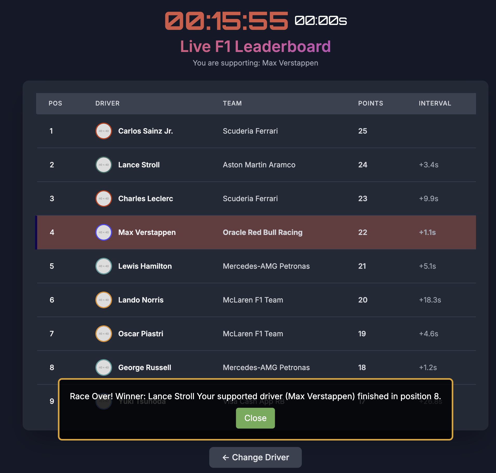

#   F1 Live Leaderboard Application

This application provides a live view of an F1 racing leaderboard, along with detailed information about a selected driver. It uses a backend (Node.js with Express) to retrieve and process data from Confluent Cloud (Kafka) and a frontend (HTML/JavaScript) to display the information.


##  Table of Contents

* [Features](#features)
* [Technologies Used](#technologies-used)
* [Prerequisites](#prerequisites)
* [Installation](#installation)
* [Running the Application](#running-the-application)
* [Backend Setup](#backend-setup)
* [Frontend Setup ](#frontend-setup)
* [API Endpoints](#api-endpoints)
* [Confluent Cloud (Kafka) Integration](#confluent-cloud-kafka-integration)
* [Redis Usage](#redis-usage)
* [Graceful Shutdown](#graceful-shutdown)


##  Features

* **Live Leaderboard:** Displays real-time F1 racing standings.
* **Driver Details:** Provides information on individual drivers, position in the lap, and interval.
* **Real-time Updates:** Leaderboard data is updated in real-time via Confluent Cloud (Kafka).
* **Backend API:** Provides a RESTful API for fetching leaderboard data.
* **Redis Caching:** Uses Redis to cache and serve leaderboard data efficiently.
* **User-Friendly Interface:** Clean and intuitive design with F1-themed styling.


##  Technologies Used

* **Backend:**
    * Node.js
    * Python
    * Redis
* **Frontend:**
    * HTML
    * CSS
    * JavaScript
* **Data Streaming:**
    * Confluent Cloud


##  Prerequisites

Before you begin, ensure you are connected to the EC2 machine. If you are not, you can connect to the machine by typing below command:

```bash
ssh -i ./<name of the pem file>.pem ubuntu@<PublicDNS>
```

* **Confluent Cloud Account:** You'll need an account on Confluent Cloud with a Kafka cluster set up. [https://www.confluent.io/confluent-cloud/tryfree](https://www.confluent.io/confluent-cloud/tryfree/)

##  Installation

1.  **Clone the repository:**
   Run below command to clone the repo.

    ```bash
    git clone https://github.com/conflkrupa/F1-Racing-Leaderboard-POC.git
    cd F1-Racing-Leaderboard-POC
    ```

2.  **Install backend dependencies:**

    ```bash
    python3 -m venv venv
    source venv/bin/activate
    cd f1_backend
    npm install
    cd ..
    ```

##  Running the Application

1.  **Run the Producer code**
      
    * [Sign in to Confluent Cloud](https://confluent.cloud/auth_callback)
    * Create an Environment and a Basic Cluster
      * Select AWS as the Cloud Provider
      * For this exercise the region is not important. You can select any region you want!
      * When Payment information is needed, enter the Promo code provided and click Apply!

    * [Create an API key](https://docs.confluent.io/cloud/current/security/authenticate/workload-identities/service-accounts/api-keys/manage-api-keys.html#add-an-api-key).<br>
         a. Navigate to the hamburger icon on top right corner and select **API Keys**.<br>
         b. Click **Add API Key**.<br>
         c. Select "My Account" and click "Next".<br>
         d. Select **Kafka Cluster** and below this, choose the Environment and Cluster you will be using and Click "Next".<br>
         
         e. Add a name and a description and click "Next".<br>
         f. Click "Download API Key" at the bottom beside Complete button and once downloaded, click "Complete"<br>
    * Go to the cluster you created before. Go to topics in the left navigation pane, click topics.<br>
    * Click "Create a topic" and name it "**f1.leaderboard.results**". Create with Defaults. Skip the data contracts for now.<br>
        
    * Modify the below scripts in your code editor and add the Confluent Cloud Kafka bootstrap server URL, API Key, and API Secret. 
    Then run these commands on EC2 Machine. You can get the boostrap server URL from the "Cluster Settings" in the Cluster overview and the API key and secret from the downloaded file.

      ```bash
          export CONFLUENT_CLOUD_CLUSTER_URL=<YOUR_CONFLUENT_CLOUD_CLUSTER_URL>
          export CONFLUENT_CLOUD_API_KEY=<YOUR_CONFLUENT_CLOUD_API_KEY>
          export CONFLUENT_CLOUD_API_SECRET=<YOUR_CONFLUENT_CLOUD_API_SECRET>
      ```

    * Run the following:
      ```bash
          python3 -m venv venv
          source venv/bin/activate
          pip install confluent_kafka
          python3 f1_producer.py
      ```
       * **Ensure this terminal window is running continuoulsy. Do not close this window.**

2.  **Start the backend server:**

    * **Open a new terminal window and SSH into the EC2 Machine.**

    ```bash
        ssh -i ./<name of the pem file>.pem ubuntu@<PublicDNS>
    ```

     * **Change directory to F1 Folder**

    ```bash
       cd F1-Racing-Leaderboard-POC
    ```

    * **Change directory to f1_backend Folder**

    ```bash
       cd f1_backend
    ```

    * Open the server.js file and edit the following lines as per your credentials.


     ```javascript
        const KAFKA_BROKERS = '<YOUR_CONFLUENT_CLOUD_CLUSTER_URL>'; // e.g., 'pkc-xxxx.region.provider.confluent.cloud:9092'
        const KAFKA_API_KEY = '<YOUR_CONFLUENT_CLOUD_API_KEY>';
        const KAFKA_API_SECRET = '<YOUR_CONFLUENT_CLOUD_API_SECRET>';
      ```

   * Run:
     ```bash
     node server.js
     ```
   * The server will start at `http://<YOUR PUBLIC DNS>:9000/api/leaderboard`.

3.  **Run the frontend:**
    * **Open a new terminal window and SSH into the EC2 Machine.**

    ```bash
        ssh -i ./<name of the pem file>.pem ubuntu@<PublicDNS>
    ```

    * **Change directory to F1 Folder**

    ```bash
       cd F1-Racing-Leaderboard-POC
    ```

    * Navigate to fronend directory,
      ```bash
        cd f1-frontend
      ```
    * Install `http-server` globally using,
      ```bash
        npm install -g http-server
      ```
    * In the same terminal, run
      ```bash
        http-server
      ```
    * This will display under which port the frontend is serving but these are internal IPs. 

    * Open any browser and type <YOUR PUBLIC DNS>:8080. (Double check in your public dns address). This will display the UI of this application.

##  Explanation of Backend Setup (`server.js`)

The backend is built with Node.js and Express. It handles API requests, retrieves data from Redis, and consumes real-time data from Confluent Cloud (Kafka).


###  Key Functionality

* **Confluent Cloud (Kafka) Consumer:**
    * Connects to Confluent Cloud using the provided credentials.
    * Subscribes to the specified Kafka topic.
    * Consumes real-time leaderboard data messages.
    * Parses the JSON messages.
    * Updates the leaderboard data in Redis and to the frontend.
* **Redis Interaction:** Stores and retrieves leaderboard data from Redis. The key `f1_leaderboard_data` is used to store the data as a JSON string.
* **API Endpoint (`/api/leaderboard`):** Provides a GET endpoint to fetch the current leaderboard data from Redis.
* **CORS:** Enables Cross-Origin Resource Sharing to allow requests from the frontend.
* **Graceful Shutdown:** Handles signals to ensure proper disconnection from Confluent Cloud (Kafka) and Redis before exiting.
* **Error Handling:** Includes error logging and handling for Confluent Cloud (Kafka), Redis, and API requests.

##  Explanation for Frontend Setup (`racing_leaderboard.html`)

   * The frontend consists of two pages that displays the live F1 leaderboard and driver information.
   * The index.html is the home page that asks user a question to choose the driver they would like to support.
   * racing_leaderboard.html consist of the code that displays leaderboard updates every few seconds and refreshes every 5 seconds.


###  Dependencies

* Tailwind CSS (CDN)
* Google Fonts (Inter, Orbitron)

###  Key Functionality

* **Data Fetching:** Fetches leaderboard data from the backend API (`/api/leaderboard`).
* **Data Rendering:** Dynamically generates the leaderboard table with the fetched data.
* **Driver Highlighting:** Highlights the selected driver in the table.
* **Clock Display:** Displays a real-time digital clock.
* **Loading Indicator:** Shows a loading spinner while fetching data.
* **Error Message Display:** Displays error messages to the user.
* **Back Button:** Provides a button to navigate back to a previous page.
* **Responsive Design:** Uses Tailwind CSS for a responsive layout.

##  API Endpoints

* `/api/leaderboard` (GET): Returns the current leaderboard data as a JSON array.


## Redis Usage
Redis acts as a high-speed, efficient layer between the backend server and the data source (Confluent Cloud Kafka). It significantly improves the application's performance, reduces the load on Kafka, and enhances the user experience by providing fast access to the leaderboard data.

* **Key:** The leaderboard data is stored under the key `f1_leaderboard_data`.
* **Data Format:** The data is stored as a JSON string.


## SUBMISSION
* After the race is complete and you see the below message, take a screen shot of the result.


Your screen shot must include all the leaderboard, the time and Change driver button at the end. For full points you need a similar screen shot as below.



If you missclick on close, you can restart by changing your driver and take a screenshot like that

**You have to submit that screen shot to the below link**

([Submit your F1 Leaderboard Data](https://form.jotform.com/252976367095371))


## Graceful Shutdown
Here are the steps to shutdown the application.

* Stop running the producer.py, server.js and http-server by clicking cmd+c/ctrl-c to stop these programs.
* Go to Confluent Cloud and delete the topic "f1.leaderboard.results" and then delete the cluster and the environment.


